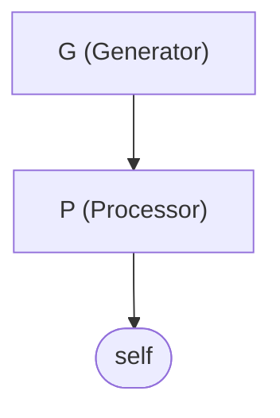

# cadpya

A Python implementation of the **IA-DEVS** (Interval-Approximated Discrete Event Systems) simulator, based on the formalism described in *"Uncertainty on Discrete-Event System Simulation"* (Vicino, Wainer, Dalle, 2021).

IA-DEVS extends classic DEVS by replacing scalar states and times with **intervals**, enabling simulation under uncertainty. When multiple components are simultaneously imminent and tie-breaking is ambiguous, the simulator explores all orderings via **BFS branching**, producing a tree of possible execution traces.

## Installation

Requires Python 3.13+.

```bash
pipenv install -e ".[dev]"
```

## Quick Start

Build a minimal Generator-Processor model and simulate it:

```python
from cadpya.basic_models.generator import ZERO_STATE, Generator
from cadpya.basic_models.processor import ZERO_TOCJ, Processor, ProcessorState
from cadpya.engine.root_coordinator import RootCoordinator
from cadpya.modeling.component import ComponentSpec
from cadpya.modeling.coupled import CoupledModel
from cadpya.modeling.decimal import Decimal
from cadpya.modeling.interval import Interval

ZERO = Decimal.zero(3)
ZERO_TIME = Interval.closed(ZERO, ZERO)

model = CoupledModel(
    components={
        "G": ComponentSpec.atomic(Generator, ZERO_STATE, ZERO_TIME),
        "P": ComponentSpec.atomic(
            Processor,
            Interval.empty(ProcessorState(tocj=ZERO_TOCJ, qj=())),
            ZERO_TIME,
        ),
    },
    influencers={
        "G": frozenset(),
        "P": frozenset({"G"}),
        "self": frozenset({"P"}),
    },
    translations={
        ("G", "P"): lambda y: Interval.closed(1, 1),
        ("P", "self"): lambda y: y,
    },
    select=lambda c: sorted(c)[0],
    zero_time=ZERO,
)

rc: RootCoordinator[Decimal] = RootCoordinator()
log = rc.simulate(model, ZERO_TIME, max_steps=50)

for entry in log[:5]:
    print(f"[{entry.branch}] t={entry.time} {entry.component} output={entry.output}")
```

## Examples

Runnable examples are in the `examples/` directory. Each produces a JSONL log in `examples/logs/`.

| Example | Description |
|---------|-------------|
| `example_4gp.py` | 4 Generators + 1 Processor (paper case study) |
| `example_counter.py` | Fast/slow generators with a counting model |
| `example_job_tracker.py` | 4G + 1P + 4 Accumulators tracking per-job counts |

Run an example:

```bash
pipenv run python examples/example_4gp.py
```

## Model Diagrams

Generate a Mermaid flowchart from any coupled model for quick debugging:

```python
from cadpya.modeling.diagram import to_mermaid

print(to_mermaid(model, title="My Model"))
```

Output (paste into GitHub markdown or [mermaid.live](https://mermaid.live)):



Nested coupled models are rendered as subgraphs with all internal couplings visible.

## Core Concepts

- **Interval[T]**: Generic interval over any totally-ordered type. Supports open/closed bounds, infinity, Minkowski addition, and subtraction.
- **Decimal**: Fixed-scale decimal type wrapping `decimal.Decimal` for precise arithmetic without floating-point error.
- **Atomic Models**: State machines with `internal_transition`, `external_transition`, `output`, and `time_advance`. Built-in models: Generator, Processor, Counter, Accumulator.
- **CoupledModel**: Pure data structure describing coupling topology — components, influencers, translation functions (Z), and SELECT tie-breaking.
- **Simulator**: Wraps one atomic model. Handles `star_function` (internal events) and `x_function` (external events).
- **Coordinator**: Wraps a CoupledModel, manages child engines. `compute_branches` finds imminent components; `execute_branch` fires transitions and routes output.
- **RootCoordinator**: BFS simulation loop. Explores branching possibilities when multiple components are simultaneously imminent with punctual time advances.

## Development

```bash
scripts/test.sh          # pytest with 90% coverage threshold
scripts/lint.sh          # ruff linting
scripts/fmt.sh           # ruff formatting
scripts/typecheck.sh     # mypy strict mode
scripts/check-all.sh     # all of the above
```

## License

BSD 2-Clause. See [LICENSE](LICENSE) for details.
